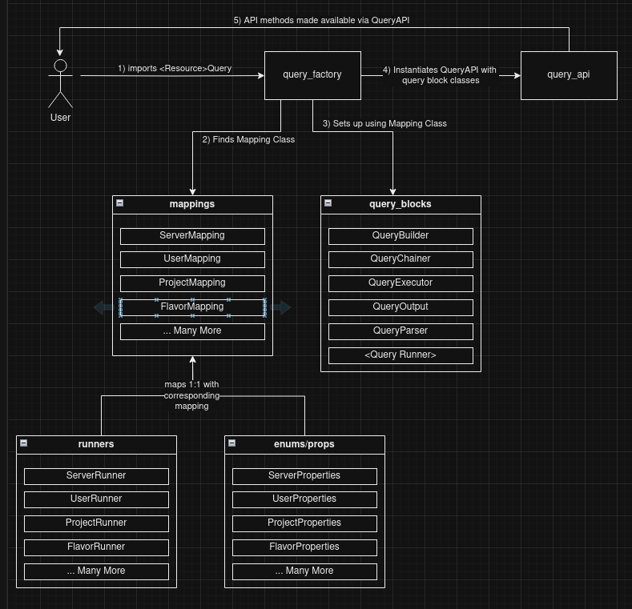

# Queries

The class diagram for how a Query object is created is shown below (see API.md for usage)




# Mappings

Each Query has a corresponding Query Mapping which is responsible for defining its behaviour.
These mappings include:
 - what property(ies) are valid to query for/with
   - and how to get those values from the equivalent Openstack object
 - what preset-property pairs are valid for `where()` calls.
 - what shared common properties (if any) are available between this resource and other resources - for chaining
 - how to actually run the query using openstacksdk

Each Query has a corresponding file called `<name_of_resource>_mapping`. The files is located in `/lib/openstack_query/mappings/`
This file is used to configure the above.

**Note**: see PROPERTIES.md for how to change property mappings

## Reference

#### get\_chain\_mappings

This method allows us to define how to chain between these two different queries.
See Chaining.md for details

#
### get\_runner\_mapping

This method allows us to attach a `Runner` Class which will be used to run the command against
openstacksdk and handle any meta-parameters.
See RUNNERS.md for details

#
### get\_prop\_mapping

This method allows us to attach a `PropEnum` Class which will be used to specify which properties the query
can work on and handle any mappings.
See PROPERTIES.md for details

#
#### get\_server\_side\_handler

This method allows us to configure server-side key-word arguments to pass directly to Openstack API servers so that they
can execute the query at the server-side. This allows for much quicker results than using client-side filter functions.
See PRESETS.md for details


#
#### get_client_side_handler

This method is used to define valid preset-property pairs that can be passed to `where()`.
See PRESETS.md for details

## Workflows

### Adding a new Query
The most common new feature for the Query Library would be adding the ability to query a new Openstack resource.
You can do so by doing the following

#### 1. Create a PropEnum Class
A new subclass of the `PropEnum` class is required to store valid property enums and mappings for your new openstack
resource. To do this, you must:
1. Identify all available properties for the new query.
   - You can find this information by looking in the openstacksdk api documentation [here](https://docs.openstack.org/openstacksdk/latest/user/index.html#api-documentation).
2. Create a new file under `/enums/query/props/` called `<resource>_properties.py`, replace `<resource>` with the name of the openstack resource you want to query
3. Create the `<resource>Properties` class definition
   - class must inherit from `PropEnum` abstract base class and implement abstract methods.
   - see example below
   ```python
   class ResourceProperties(PropEnum):

       # add enums for each property you found here like so
       PROP_1 = auto() # replace `PROP_1` with property name
       ...

       @staticmethod
       def get_prop_mapping(prop):
           ...
           # add prop mappings here. See PROPERTIES.md for details on this
           mapping = {
              ResourceProperties.PROP_1: lambda a: a["prop_1"]
           }
           try:
              return mapping[prop]
           except KeyError as exp:
               raise QueryPropertyMappingError(
                   f"Error: failed to get property mapping, property {prop.name} is not supported in FlavorProperties"
               ) from exp

       @staticmethod
       def get_marker_prop_func():
           ...
           # marker prop func returns the mapped function for the property that can be used as the marker
           # for pagination - see RUNNER.md for details.
           # here you need to replace ResourceProperties.PROP_1 with the appropriate property enum that can be used as the
           # marker for pagination - this is usually the ID property
           return ResourceProperties.get_prop_mapping(ResourceProperties.PROP_1)
   ```

#### 2. Create a Runner Class
A new subclass of the `RunnerWrapper` class is required to store how to actually run the query using openstacksdk. It
will also be the place where we can define extra parameters that can be used to fine-tune the query.
See meta-parameters in RUNNERS.md for examples.

To add a Runner Class:
1. Create a new file under `/openstack_query/runners/` called `<resource>_runner.py` replace `<resource>` with openstack resource name you want to query
2.  Create the `<resource>Runner` class definition
   - class must inherit from `RunnerWrapper` abstract base class and implement abstract methods.
   - see example below
   ```python
   class ResourceRunner(RunnerWrapper):
       ...
       # specify the openstacksdk resource type
       RESOURCE_TYPE = Resource

       def _parse_meta_params(
           self,
           conn: OpenstackConnection

           # define meta params that could be passed
           # they should all be optional, if no meta-params are passed, the query should still work with default values
           meta_param_1 = None,
           meta_param_2 = None,
           ...
       ):
           # Define logic here that will alter the keyword arguments that will be passed to the openstacksdk command
           # based on the meta-parameter values passed in. This method should return a dictionary which will be merged with
           # server-side filters and be used when calling the specific openstacksdk query which gets the resources being queried for
           ...

       def _run_query(
           self,
           conn: OpenstackConnection,
           filter_kwargs: Optional[ServerSideFilters] = None,
           **meta_params,
       )
           # Deine logic here that will setup keyword arguments - merging server-side kwargs (filter_kwargs) and meta_param
           # and call run_paginated_query
           ...

           # here we call `run_paginated_query` with the "dummy" openstacksdk call "conn.compute.resource"
           # and we call it with key-word arguments, merging both filter_kwargs with parsed meta-params returned from
           # self._parse_meta_params

           # see RUNNER.md for more info on paginated queries

           # you can other types of queries/logic here - this is up to your discretion
           return self._run_paginated_query(conn.compute.resource, **{filter_kwargs, meta_params})
   ```

#### 3. Create a Mapping Class

A new subclass of the `MappingInterface` class is required to store query mappings (see above).

To add a Mapping Class:
1. Create a new file under `/openstack_query/mappings/` called `<resource>_mapping.py` replace `<resource>` with openstack resource name you want to query
2.  Create the `<resource>Mapping` class definition
   - class must inherit from `MappingInterface` abstract base class and implement abstract methods.
   - see example below
```python

class ResourceMapping(MappingInterface):
    ...

    @staticmethod
    def get_chain_mappings():
        # here you need to define if there any shared-properties between this query's properties and other queries.
        # used when chaining. See CHAINING.md for more info

    @staticmethod
    def get_runner_mapping() -> Type[ResourceRunner]:
        """
        Returns a mapping to associated Runner class for the Query (ResourceRunner)
        """
        # this is using the "dummy" ResourceRunner defined earlier
        return ResourceRunner

    @staticmethod
    def get_prop_mapping() -> Type[FlavorProperties]:
        """
        Returns a mapping of valid presets for server side attributes (ResourceProperties)
        """
        # this is using the "dummy" ResourceProperties defined earlier
        return ResouceProperties

    @staticmethod
    def get_server_side_handler() -> ServerSideHandler:
       ...
        # here you need to define server-side filters. See PRESETS.md for details

    @staticmethod
    def get_client_side_handlers() -> ServerSideHandler:
       ...
        # here you need to define valid preset-property pairs that can be used with where().
       # See PRESETS.md for details

```

### 4. Create entry in query_objects.py

Now that the functionality has been added, you can make it available by creating a function in `query_objects` which
will call `QueryFactory` with the `ResourceMapping` class we just created.

e.g. Add this function to `openstack_query/api/query_objects.py` (as usual, replace `Resource` with the name of the openstack resource your querying)
```python
def ResourceQuery() -> QueryAPI:
   """
   Simple helper function to setup a query using a factory
   """
   # call the mapping class you just created - remember to import it as well!
   return get_common(ResourceMapping)

```

Then add this import to the top-level `__init__.py` - in `openstack_query/__init__.py`
```python
from .api.query_objects import ResourceQuery
```


Now you can use the new functionality like so

```python
from enums.query.props.resource_properties import ResourceProperties
from openstack_query import ResourceQuery

ResourceQuery().where(...).select(ResourceProperties.PROP_1).run("prod", meta_param1="abc", meta_param2="def")
```
