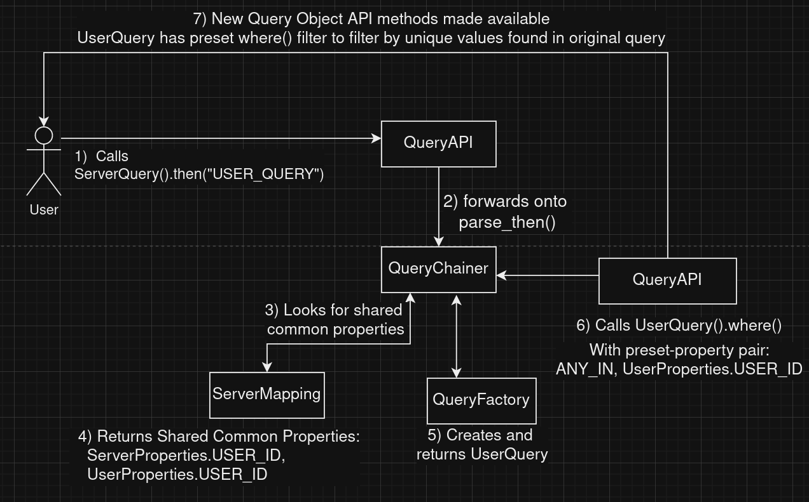

# Chaining

A feature that the query library adds is the ability to chain queries together.

Chaining, in this context means taking the results of a query, and using them to configure and run another query
    - be it on the same resource, or on another resource.

## How then() works

The diagram below shows how we can use `then()` to perform chaining between two different Openstack Resources.
`then()` will return the new query, shunting any results into new query if `keep_previous_results = True`
see [API.md](user_docs/API.md) for usage details

Here, `then()` finds all unique values of `user_id` from the results of the first `ServerQuery` query.
Using these, it sets up a `UserQuery` with a pre-defined `where()` call - selecting for `user_ids` match
what was returned in the first query

`get_chain_mappings` holds how to map the query to other queries. Which we look for in `ServerMapping`

## How append_from() works

The diagram below show how we can use `append_from()` to perform chaining between two different Openstack Resources.
`append_from()` will run a separate query internally, and shunt the results into original query, it will return the original query
see [API.md](user_docs/API.md) for usage details

Here, `append_from()` works almost identically to `then()`, only this time, it runs a `select` selecting for specified
properties - e.g `user_name` that belong to `UserQuery`. This is then returned and concatenated into results via
`ResultContainer` class as `forwarded_props`.

## Shared common properties

A shared common property is are pairs of properties that hold the same information between two different openstack
resources. These properties can either:
1. Map one-to-Many. e.g. `UserQuery` to `ServerQuery`
- the shared common property is `user_id`
- A User can have many associated servers - so in this case one `user_id` can map to multiple servers

2. Map Many-to-one. e.g. going backwards from `ServerQuery` to `UserQuery`
- The shared common property is still `user_id`

Query Library supports both instances.

## Successive Chaining and Multi-step chaining
The query library has functionality to allow multi-step chaining - this is currently left for the user to implement
    - via successive `then()` chaining.

If we find that there are workflows that require successive chaining - we can add it as a `pattern` - this is a WIP

### Keeping Previous Results

A common workflow may want to keep certain results from previous chained queries (see [API.md](user_docs/API.md) for how to do that)

- `append_from` will automatically forward selected values as `forwarded_props` to results
- `then` gives the user the option to

**Note Many-to-one property chaining can lead to duplicates** - this is left to the user to sort out

## Workflows
