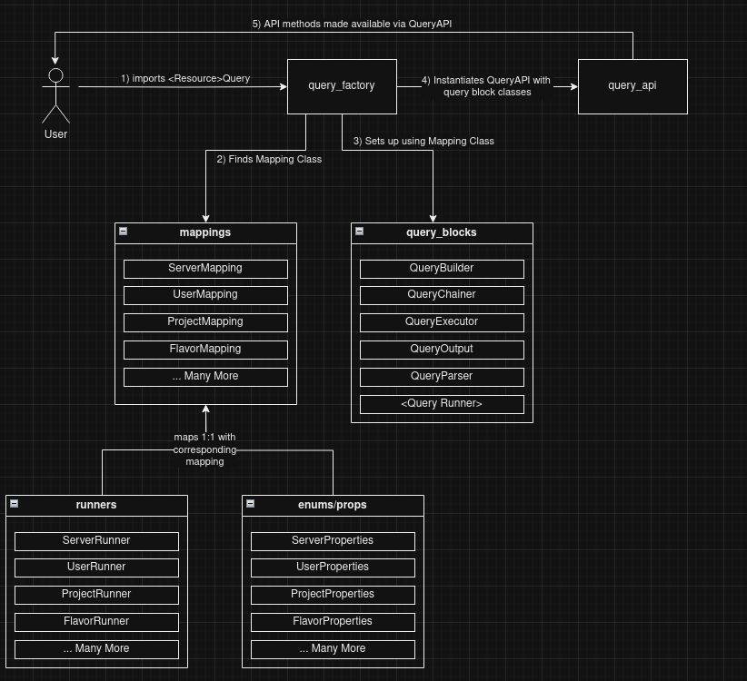

# Developer Notes

## Workflow Links
- #### [Adding a new Query Feature](ADDING_NEW_QUERIES.md)
- #### [Adding a new Preset](ADDING_NEW_PRESETS.md)
- #### [Other smaller workflows](OTHER_WORKFLOWS.md)

## Other Links
- #### [Chaining Notes](CHAINING.md)

## Overview

The Query Library is broken up into 3 main parts.
- Query Blocks
  - which contain actual query logic split up into different parts - builder, executer, etc.
- Mappings
  - contains info that is specific to the query, used to setup query blocks
- API
  - exposes API methods to the user

The image below shows how these components relate to each other when invoking a query object via API

## Query Blocks

Query Blocks contain the generic logic of setting up, running and outputting the query results.
Each Query Block is instantiated and set up using mappings.
Query block files are located in `openstack_query/query_blocks/` submodule

Query Blocks are written so they don't need to be edited when a new feature needs to be written.
As a developer, you likely won't need to worry about them unless you are fixing bugs/refactoring

## Query Mappings

Each resource the query library supports has a corresponding Mapping class which is responsible for defining its behaviour.
These class sets up the following:
 - what property(ies) are valid to query for/with
   - and how to get those values from the equivalent Openstack object
 - what preset-property pairs are valid for `where()` calls.
 - what shared common properties (if any) are available between this resource and other resources - for chaining
 - how to actually run the query using openstacksdk

Each Query has a corresponding file called `<name_of_resource>_mapping`. The files is located in `/lib/openstack_query/mappings/`
This file is used to configure the above.

## API

The API is the part the users interact with. We setup a `QueryAPI` object that exposes a set of public methods through
which the user can setup, run and output the query results without needing to know anything about how it is interacting
with openstack.

The API must be unchanging - as a developer you will not need to interact with this file unless you are adding a new
API method - e.g. adding a new way to output results

**NOTE: Deleting or Altering a API method requires approval and a good reason since it may break existing workflows **

### Client-Side Filters vs Server-Side Filters

Another feature of the query library is that it will try to utilise the openstacksdk as much as possible when
running these queries. This has the following benefits

1. Queries runs quicker - since the query is handled at the database side
2. Less calls to Openstacksdk than using client-side filters - since we don't need to get all resources

This is done by utilising "server-side" filters. Called such because they are filters that are used at the "server"
side by the Openstack API server(s).

These server-side filters are mapped and used automatically without any user-input. This has the following benefits:

1. No need to learn the syntax of ever-changing openstack versions to get faster queries
2. We have decoupled this library from a specific version of Openstack making upgrading easier

We also want this library to add filter functionality that doesn't currently exist in Openstack - to do this, we
have defined some filter functions to act after retrieving data from Openstacksdk. These filter functions are known as
"client-side" filters - since they are used at the client-side running locally via this library.

client-side filters allow us to add filters that don't exist in Openstack - meaning that we can add functionality that
you would normally need to write yourself via long bash scripts.

### Handlers

"Handlers" are classes that hold mappings between preset-property pairs and filters.
There are two types of handlers - client-side and server-side.

You likely will not need to worry about handlers - unless you are adding new presets

In the case of client-side handlers this is where the client-side filter functions are defined.
